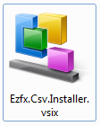
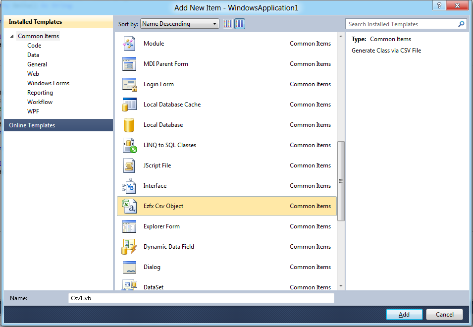
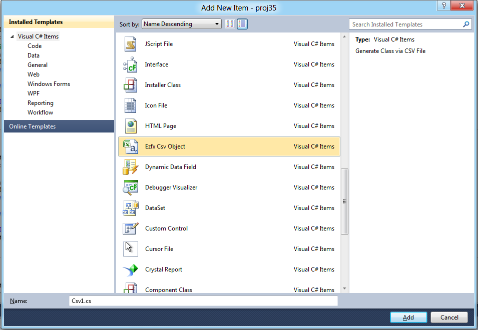
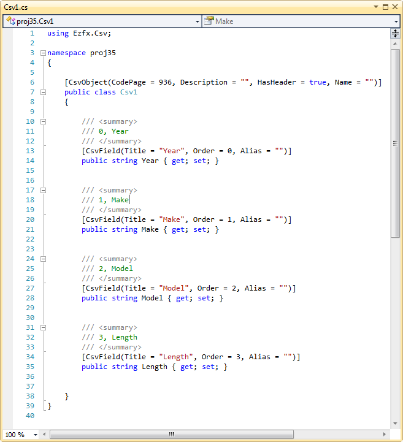
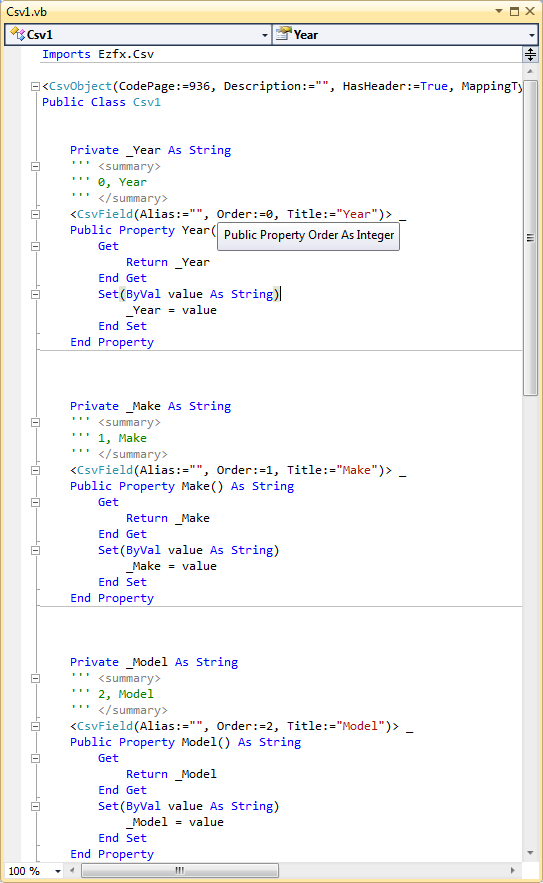
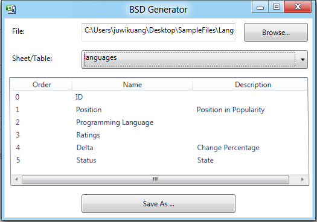

# CSV2Entity

To view the introduce Video please visit:

[https://youtu.be/z3eB05DaQuI](https://youtu.be/z3eB05DaQuI)

## What is CSV

CSV is the abbreviation of Comma-separated values, a file format stores tabular data in plain-text form, usually with .csv extension. CSV is a simple file format that is widely supported by consumer, business, and scientific applications.

Examples

Example of a USA/UK CSV file

	Year,Make,Model,Length

	1997,Ford,E350,2.34

	2000,Mercury,Cougar,2.38

 
    

 
## CSV Entity

In order to build CSV entities, we need something more. Csharp’s Attribute Mechanism provides us what we need by decorate CSV class properties with a custom attribute. Custom attribute defines CVS field’s display name and order. Here is the CsvFieldAttribute:

	public class CsvFieldAttribute:Attribute

	{

       public string Name { get; set; }

       public int Order { get; set; }

	}

With CsvFieldAttribute, now we can decorate our own class.

	public class Car

	{

       [CsvField(Name = "Year", Order = 0)]

       public string Year { get; set; }

       [CsvField(Name = "Make", Order = 1)]

       public string Make { get; set; }

       [CsvField(Name = "Model", Order = 2)]

       public string Model { get; set; }

       [CsvField(Name = "Length", Order = 3)]

       public string Length { get; set; }

	}

## Generate CSV Class

So, do we need to create CSV classes manually? Of cause not. So I developed the following tool to generate CSV classes:

To Generate CSV Classes, you have to install the VSIX file:

      

 

After the installation a new template called EZFX CSV Class will be displayed in your Visual Studio 2010 both in language VB and C#.

Add VB Class:

Add C# Class:

After click of add, a CSV Generate Wizard Window will be displayed, you can select a CSV file by click the browse button, this Wizard support Excel(xls, xlsx) and Access files(mdb, accdb), too. You specify the encoding for the CSV file and table name for Excel and Access file.

 

The following is the generated file:

The C# file:

The VB file:

This is a .Net 3.5 Version of VB file. For the 4.0 Version, the get and set body can be omitted. I will add this feature in the coming version.

 

 

## CSV Reader

At last, we need a way to read CSV files and put data into the CSV classes. The method is: split CSV line to an array, iterate over that array get index of each field, and reflect the CSV class (i.e. Cars above) get order of each property. When index of field and order of property matches each other, transmit the value.

 

Following is the result from Visual Studio 11 watch window.

 

## Document Generator

With Document Generator, you can get the schema of the CSV files or the Excel and Access files and save the result to a CSV file for further edit.

References

CSV in Wikipedia: http://en.wikipedia.org/wiki/Comma-separated_values

